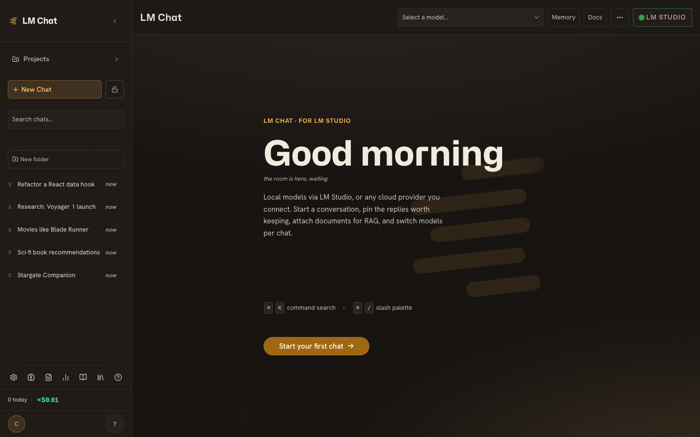
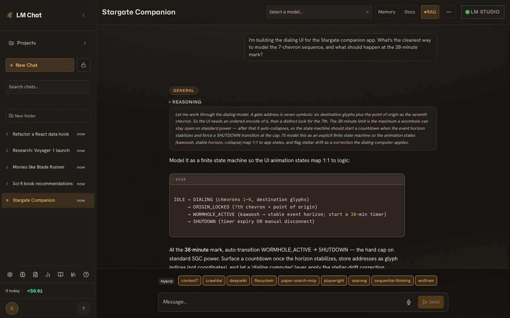
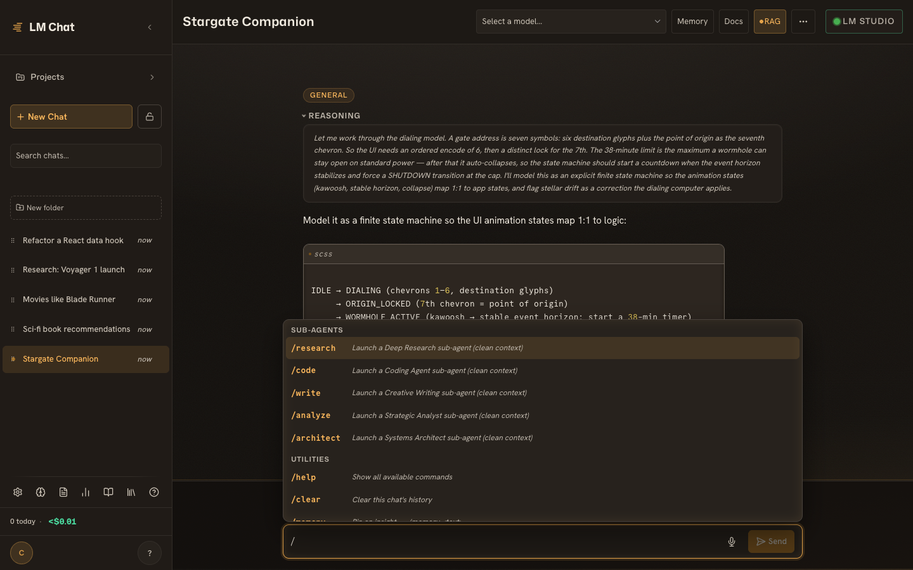
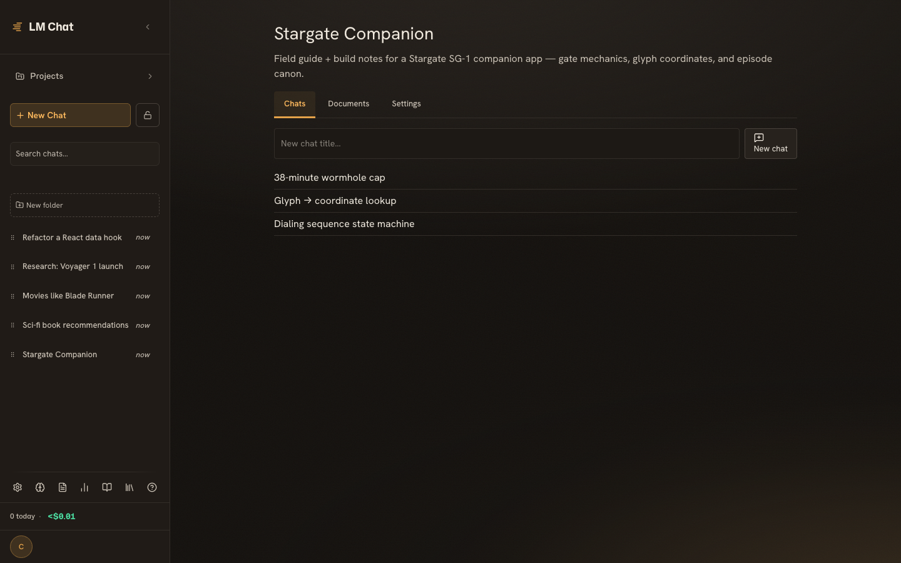
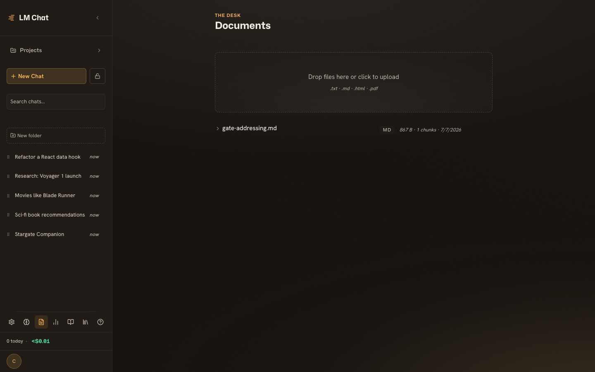
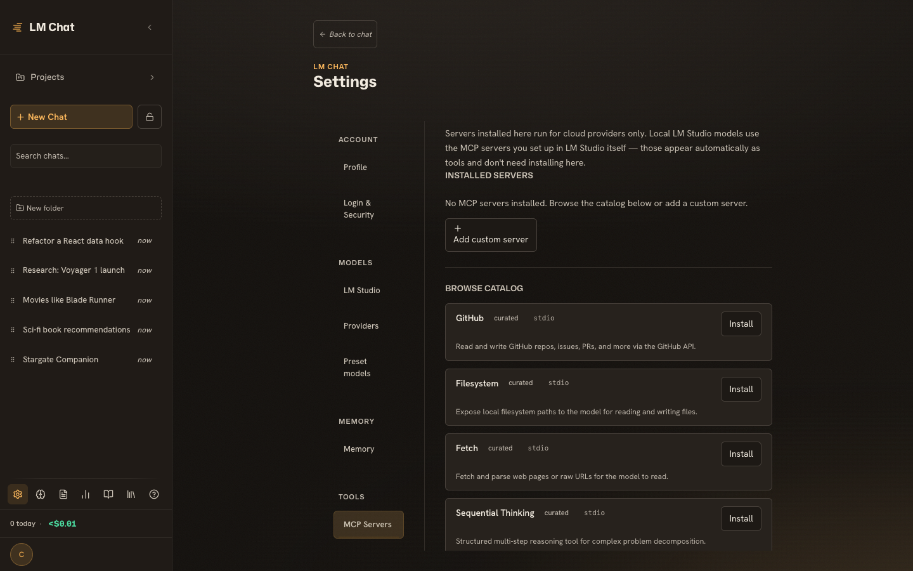

# LM Chat

> A self-hosted, multi-user chat app built around **LM Studio** — with projects, documents, adaptive memory, and sandboxed MCP tools. Bring a cloud model (OpenAI, OpenRouter, Groq, or any OpenAI-compatible endpoint) when you want one.

[](https://github.com/Chevron7Locked/lm-chat/releases)
[](LICENSE)
[](pyproject.toml)
[](https://github.com/Chevron7Locked/lm-chat/pkgs/container/lm-chat)



LM Chat is a self-hosted chat application, built around LM Studio and meant to run on your own hardware. It will talk to OpenAI, OpenRouter, Groq, or any OpenAI-compatible endpoint when you want a cloud model, but the local path is the one it is designed around.

## Contents

- [Built around LM Studio](#built-around-lm-studio)
- [What you get](#what-you-get)
- [Accounts](#accounts)
- [Install](#install)
- [Providers and models](#providers-and-models)
- [Security](#security)
- [Documentation](#documentation)
- [License](#license)

## Built around LM Studio

Many clients reach a local model through a generic OpenAI-compatible endpoint and leave it there. LM Chat prefers LM Studio's own `/api/v1/chat` surface and uses it by default: LM Studio keeps the conversation history on its side, streams reasoning and tool calls back as typed events instead of opaque text, and can run its own MCP tool servers alongside the chat. The compatible endpoint is still available, and it is the same interface LM Chat uses for the cloud providers, so you can run locally through it too — you just give up the native features above.

LM Chat also handles the ways LM Studio behaves in practice: it re-probes which model is really loaded every few seconds, reconciles the gap between a model's catalog name and the instance id it was loaded under, and sends the API key once you have set one. These cases are easy to miss in a thinner integration, and when they are missed the stream stops without telling you why.


*Reasoning arrives in a collapsible block, a persona chip marks the mode, tool servers line the composer, and code renders inline.*

## What you get

- **Chat and reasoning.** Tokens stream as they arrive, reasoning shows in collapsible blocks that Cmd/Ctrl+J folds all at once, tool calls render as cards, sources come back as inline citations, and a meter tracks how much of the context window you have spent.
- **Personas and sub-agent modes.** Six personas are built in, for general chat, coding, creative work, research, analysis, and architecture, alongside a raw `None`. Beside those, `/research`, `/code`, `/write`, `/analyze`, and `/architect` open a clean-context thread that runs without loading the chat's history or writing anything until it resolves, and then hands the result back.
- **Tools (MCP).** Two MCP systems sit side by side, and the chat's endpoint decides which one runs. On the native LM Studio endpoint, LM Studio hosts its own `mcp.json` servers and makes the tool calls itself — LM Chat reads that file to list them in the composer and names the ones you enable in the request; it never runs them. On the OpenAI-compatible and cloud providers, LM Chat runs its own MCP Store instead: 23 servers that install in a click and execute inside the app's own container, where each stdio process is confined by a Landlock ruleset so a tool server can never read the database or the app's secrets. The composer only shows the active system's servers, and a Store server can also run client-side against a native local model when you want a tool LM Studio isn't hosting. Servers can be local (stdio) or remote (SSE or HTTP with bearer auth), tools can be allowed or denied per server, and any credentials they need are encrypted at rest.
- **Documents and RAG.** Upload `txt`, `md`, `html`, `pdf`, `epub`, and `docx`; retrieval fuses FTS5 keyword search with vector search using reciprocal rank fusion, in inline, hybrid, or focused modes, with the embedding model pinned per project.
- **Projects.** A project gathers a system prompt, a document knowledge base, and its chats, and new chats inherit all of it. You can archive a project, export it as a bundle, give it its own default model and retrieval threshold, or promote an existing chat into a fresh project, which carries the history over and lets you bring specific documents along.
- **Memory.** Pin insights yourself, or let a background pass distill the durable facts out of a conversation after each turn, and refine or restore them later.
- **Prompt library.** Save prompts and drop them into any chat with `/prompt`.
- **Quality modes.** For answers worth the extra tokens, self-consistency samples several attempts and reconciles them, and chain-of-verification has the model draft, interrogate its own draft, and revise.
- **Organizing.** Group chats into folders by dragging or with the keyboard, keep the important ones pinned in a band of their own, or run a chat in incognito, which writes nothing to memory, refuses to be shared, and purges itself after an hour.
- **Sharing and export.** Share a conversation as a read-only link you can revoke at any time, or export the whole thing to Markdown or JSON.
- **A/B compare.** `/compare` streams two models side by side so you can watch them diverge.
- **Compaction.** When a conversation outgrows the window, `/compact` summarizes its oldest stretch with a local model and folds it into a recall tab. Nothing is deleted; you can open the tab and read the originals.
- **Voice.** Browser speech-to-text (Chrome, Edge, and Safari) drops its transcript into the composer and leaves the sending to you.


*Every slash command — sub-agent modes, `/compare`, `/compact`, `/prompt` — one keystroke away.*


*A project bundles a system prompt, a document knowledge base, and its chats — new chats inherit all of it.*


*Drop in `txt`, `md`, `html`, or `pdf`; each file is chunked and retrieved with hybrid keyword + vector search.*


*The MCP Store — one-click tool servers that run sandboxed inside the app's own container (for cloud and compatible endpoints; LM Studio hosts its own).*

## Accounts

LM Chat is multi-user, in a deliberately small way. The first person to register becomes an admin, and after that the only way in is an invitation, which the admin issues from the admin panel. Each account keeps its own private chats, documents, and memory, while the provider and tool configuration is shared and owned by the admins. There are no permission tiers, groups, or single sign-on to stand up, because it is meant for a handful of trusted people sharing one instance rather than an organization with a directory to manage.

## Install

The quickest way in is Docker:

```bash
cp deploy/.env.example deploy/.env
# Set LM_CHAT_SECRET in deploy/.env. The app will not start without it.
# Generate one with: python -c "import secrets; print(secrets.token_urlsafe(32))"
docker compose -f deploy/docker-compose.yml up -d
```

The image builds itself from source the first time it comes up, and it carries a Python, Node, and uv runtime inside so the `npx`- and `uvx`-based MCP servers can run in the container without anything on the host. Your data lives in a named volume at `/data/lmchat.db`, and the app listens on port 8000 unless you move it with `LM_CHAT_HOST_PORT`. Point it at your LM Studio instance, which is at `http://localhost:1234` by default, open the app, register the first account, and you are chatting.

Prefer a prebuilt image? Pull the published container instead of building:

```bash
docker pull ghcr.io/chevron7locked/lm-chat:latest
```

If you would rather run it from source:

```bash
uv run uvicorn lmchat.app:app --port 8011 --reload   # backend, Python 3.11+
cd web && pnpm install && pnpm dev                     # frontend, proxies /api to the backend
```

`LM_CHAT_SECRET` is the one setting the app refuses to start without. A cloud-only setup needs no LM Studio at all; for local inference, LM Studio should be running with a model loaded.

## Providers and models

LM Studio is configured per user over an admin-set default, in whichever endpoint mode you prefer. The cloud providers live under Settings, where OpenAI, OpenRouter, Groq, and any custom OpenAI-compatible endpoint each come with a test-connection probe and a per-provider model allowlist. There is no built-in Anthropic provider; if you want Claude, reach it through OpenRouter or an OpenAI-compatible gateway.

## Security

LM Chat is meant to be hosted by you, on your own network, and the defaults are set for that.

Provider and LM Studio API keys are encrypted at rest with AES-256-GCM in a versioned envelope and are never sent back to the browser. MCP tool servers run under a Landlock ruleset that keeps them away from the database and the app's environment, though it is worth knowing that Landlock is a Linux feature: run from source on another platform and the sandbox is skipped with a warning unless you require it with `LM_CHAT_MCP_REQUIRE_SANDBOX=1`. Every page, including read-only share pages, carries a strict CSP built on a per-request nonce with no `unsafe-inline`, and every user sees only their own chats, projects, documents, and memory, filtered at the database query rather than bolted on at the API. A token bucket rate-limits the login endpoint, a separate per-user limit throttles streaming, and two-factor authentication uses TOTP, enrolled by pasting the `otpauth://` link or the base32 secret into any authenticator app. A fixed taxonomy of auth, admin, chat, message, stream, folder, and memory events feeds the audit log, Prometheus metrics are exposed at `/api/metrics`, and CodeQL, container image scanning, and OSSF Scorecard all run in CI.

## Documentation

The full user guide ships inside the app, in a `/docs` reader that covers the quickstart, a walk through each feature, an architecture overview, and an API reference. The same pages sit in the repository as Markdown under [`guide/`](guide/) if you would rather read them there.

## License

LM Chat is Apache-2.0, with the explicit patent grant that license carries. It was relicensed from AGPL-3.0 at version 0.6.0, and `NOTICE` keeps the earlier attribution intact.
