# lm-chat

<p align="center">
  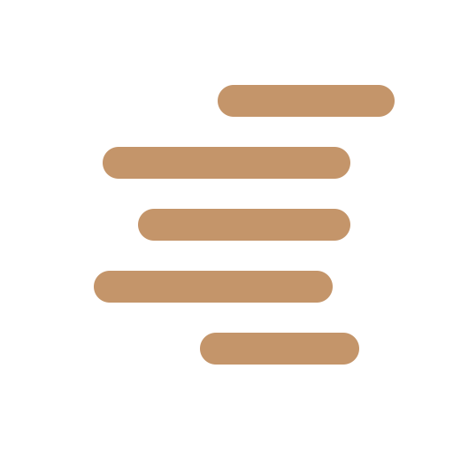
</p>

<p align="center">
  <strong>Your local models deserve a real frontend.</strong><br>
  Web access. Adaptive memory. Multi-user. Built on LM Studio's native API.
</p>

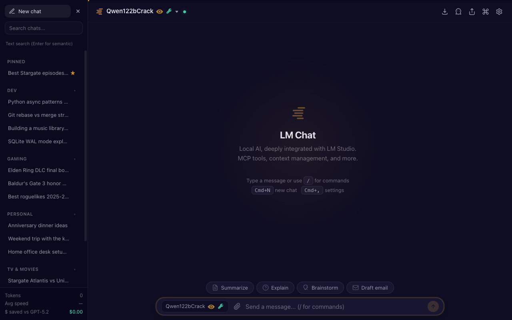
*Main chat view — dark theme, desktop*

---

## What is this?

I use local LLMs for everything — brainstorming, planning, day-to-day questions, recommendations based on what I've already told it. The kind of stuff you'd use any AI assistant for, except it's running on my own hardware. LM Studio handles inference really well, but I kept hitting the same wall: no web access. I couldn't pick up a conversation from my phone, share the server with anyone else, or have it remember context across sessions without the desktop app open in front of me.

lm-chat fills that gap. It's a web frontend that handles everything around LM Studio — browser access from any device, persistent conversations that survive model swaps, adaptive memory that learns who you are, and multi-user auth so your whole household or team can share one server.

It's the only web client built on LM Studio's native API (`/api/v1/chat`), so you get MCP tools, server-managed conversation history, and model-aware features that aren't available through the OpenAI compatibility layer. No re-implementation, no compatibility hacks — just a tight integration with everything LM Studio already does well.

No `pip install`, no `npm`, no build step. Just run it.

### Docker (recommended)

```bash
docker run -d -p 3001:3001 -v ./lm-chat-data:/app/data \
  -e LMSTUDIO_URL=http://host.docker.internal:1234 \
  ghcr.io/chevron7locked/lm-chat:nightly
```

Multi-arch: `linux/amd64` + `linux/arm64` (Apple Silicon, Raspberry Pi).

### From source

```bash
git clone https://github.com/chevron7locked/lm-chat.git
cd lm-chat
python3 server.py
```

Open `http://localhost:3001`. Log in with the admin credentials printed to the console (see [First Run](#first-run) below).

**Requirements:** Python 3.10+ (or Docker) and LM Studio running with at least one model loaded.

### First Run

Authentication is **on by default**. On first launch, lm-chat creates an admin account and prints the credentials to stderr:

```
==================================================
  Admin account created
  Username: admin
  Password: <random-password>
  (set LM_CHAT_ADMIN_PASS to use your own)
==================================================
```

Copy the password from the terminal and log in at `http://localhost:3001`. You can change it in **Settings → Security** once logged in.

To set your own credentials upfront:

```bash
LM_CHAT_ADMIN_USER=myname LM_CHAT_ADMIN_PASS=mypassword python3 server.py
```

Or with Docker:

```bash
docker run -d -p 3001:3001 -v ./lm-chat-data:/app/data \
  -e LMSTUDIO_URL=http://host.docker.internal:1234 \
  -e LM_CHAT_ADMIN_USER=myname \
  -e LM_CHAT_ADMIN_PASS=mypassword \
  ghcr.io/chevron7locked/lm-chat:nightly
```

To disable auth entirely (single-user, trusted network): `LM_CHAT_AUTH=false`.

Once logged in as admin, you can invite other users from **Settings → Users**.

---

## Why the Native API?

Most third-party UIs talk to LM Studio through `/v1/chat/completions` — the OpenAI compatibility layer. lm-chat is built on `/api/v1/chat`, LM Studio's native endpoint. This matters because the native API exposes features the compatibility layer doesn't:

| Feature | Native API (`/api/v1/chat`) | OpenAI Compat (`/v1/chat/completions`) |
|---------|---------------------------|---------------------------------------|
| MCP tool execution | LM Studio runs your MCP servers | Not available |
| Response ID chaining | Server-managed history | Client resends everything |
| Reasoning events | Real SSE events | Parse `<think>` tags yourself |
| Capability detection | Vision, tool_use flags | Not available |
| Model context config | Exposed | Not available |

**Response ID chaining** is the big one. LM Studio manages the full conversation history server-side. lm-chat sends only the new message + a reference to the previous response. No token waste re-sending the entire history every turn.

LM Studio's desktop app uses all of this natively. lm-chat is the first web client that does too.

---

## Features

### Chat

- **SSE streaming** with live token stats (tokens/sec, time-to-first-token)
- **MCP tool execution** — uses whatever MCP servers you've configured in LM Studio (Brave Search, Memory, Sequential Thinking, etc.), plus any remote MCP endpoint
- **Native reasoning display** — thinking blocks from reasoning models (DeepSeek-R1, QwQ, etc.) in collapsible sections, with configurable reasoning depth (Off / Low / Medium / High)
- **Stop, edit, resend, regenerate** — full conversation control
- **Conversation forking** — branch from any message to explore alternatives
- **Auto-generated titles** via LLM
- **Suggested follow-ups** — optional follow-up questions after each response

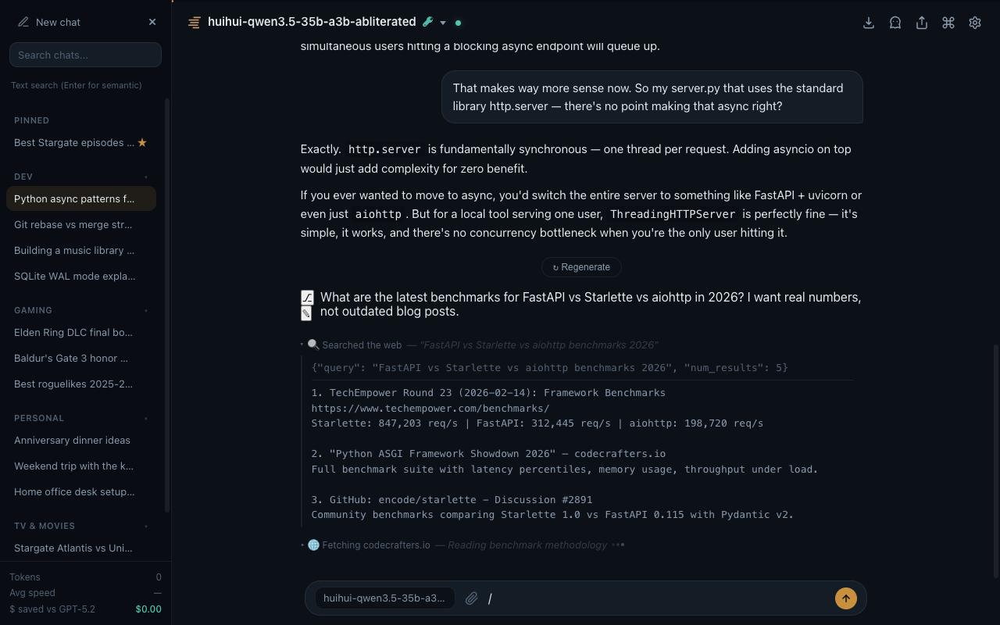
*Live MCP tool call with streaming arguments — desktop*

### Conversation Organization

Pin your most-used chats, group related conversations into folders, and find anything instantly.

- **Pinned chats** — star any conversation to keep it at the top of the sidebar
- **Folders** — create named folders to organize chats by project, topic, or whatever makes sense to you (Code, Recipes, Work, etc.)
- **Collapsible sections** — folders collapse/expand with a click, keeping the sidebar clean
- **Recent section** — everything else, sorted by last activity
- **Text search** — type in the search bar to filter chats by title instantly
- **Semantic search** — press Enter to search by meaning across all messages (requires an embedding model in LM Studio)

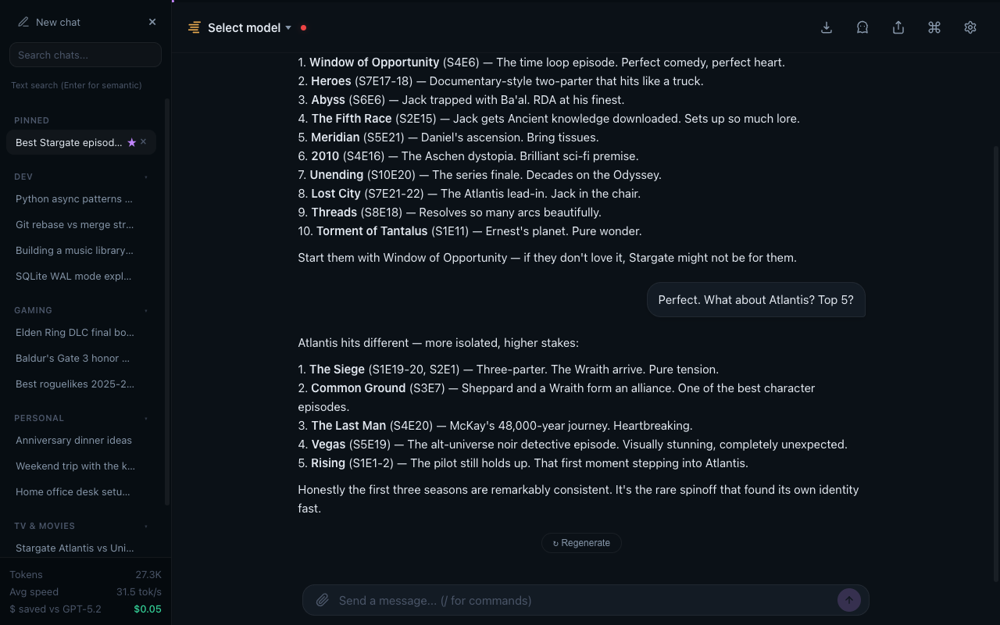
*Sidebar with pinned chats, folders, and recent conversations — desktop*

### Agent Modes

Six system prompt presets, each tuned for a specific task. Switch from the settings panel dropdown or activate via slash commands:

| Command | Mode | Temperature |
|---------|------|------------|
| `/research` | Deep Research — multi-source synthesis | 0.4 |
| `/code` | Coding Agent — doc lookup, structured planning | 0.1 |
| `/write` | Creative Writing — craft-focused workshop | 0.9 |
| `/analyze` | Strategic Analyst — framework-driven analysis | 0.3 |
| `/architect` | Systems Architect — technical design | 0.2 |

Or choose **Custom** to write your own system prompt with template variables (`{{current_date}}`, `{{model}}`, `{{memories}}`, etc.).

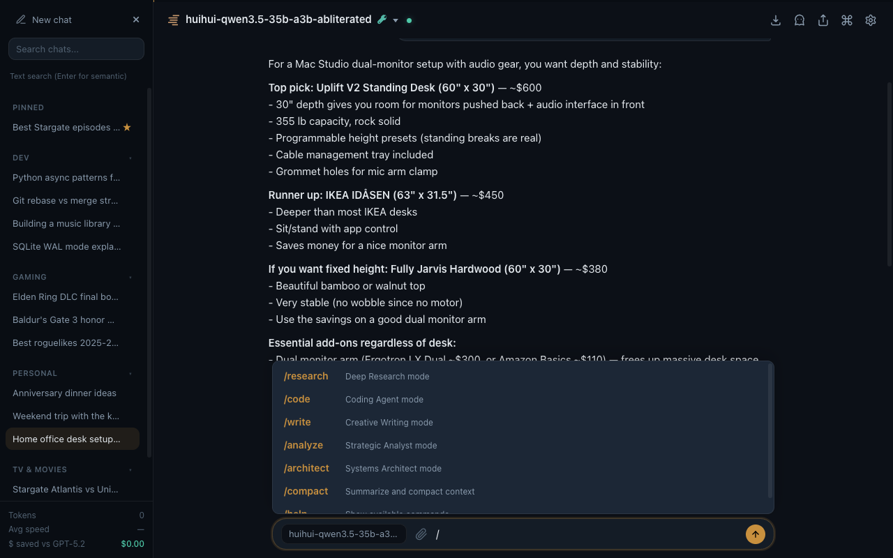
*Slash command autocomplete — desktop*

### Share Conversations

Share any conversation as a read-only page. One click generates a unique URL — no login required to view.

- **Full markdown rendering** — code blocks, formatting, and structure preserved
- **Standalone pages** — no JavaScript required, works anywhere
- **Strict CSP headers** — shared pages are sandboxed (no scripts, no framing, no external resources)
- **Revocable** — delete the share anytime from the chat menu

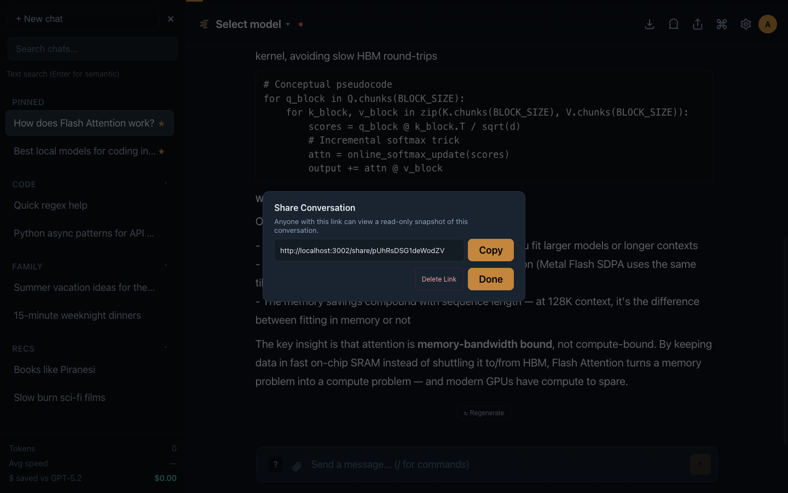
*Shared conversation — read-only page with dark theme*

### Adaptive Memory

Your context follows you — across conversations, across model swaps. lm-chat builds a profile of your preferences, projects, skills, and opinions without you lifting a finger.

- **Auto-distillation** — insights extracted from conversations without asking
- **Cognitive decay** — stale memories fade naturally (freshness × usage scoring)
- **Category-weighted injection** — identity stays, trivia drifts
- **Full user control** — view, edit, delete, toggle on/off
- **Zero external dependencies** — SQLite-backed, no vector store required

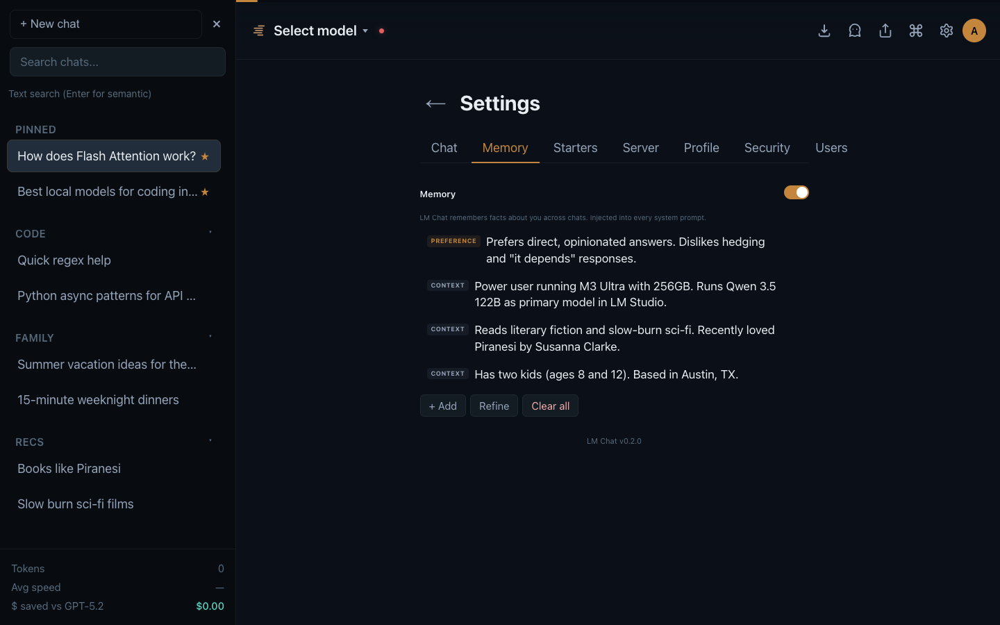
*Memory panel — categorized insights with decay indicators*

### Context Management

- **Context gauge** — live visualization of context window usage, click to compact
- **`/compact`** — LLM-summarized context when you need to free up space
- **Instruction sandwich** — core instructions reinforced at end of system prompt for better adherence with local LLMs (they have recency bias — exploit it)

### MCP Tools

Your LM Studio MCP servers just work — configure them in `~/.lmstudio/mcp.json` and they show up automatically through the native API. Toggle per-conversation in the UI.

**Remote MCP** — Connect additional MCP endpoints with URL + optional auth. Per-server credentials stored securely server-side.

### Model Management

- **Hot model switching** — topbar dropdown or input pill
- **Capability badges** — Vision, Tool Use auto-detected per model
- **Full sampling control** — temperature, top_p, top_k, min_p, repeat_penalty, max output tokens
- **Reasoning depth** — Off / Low / Medium / High for supported thinking models
- **Context config display** — context length, eval batch size, parallel slots from model config
- **Connection monitoring** — live status indicator with 30s health polling

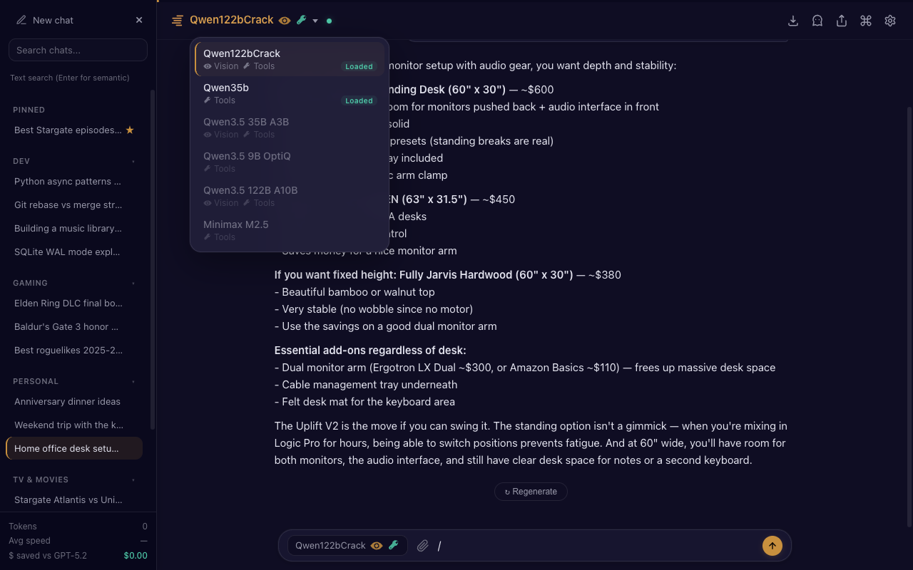
*Model switching with capability badges — desktop*

### Settings

Unified full-page settings with tabbed navigation — one place for everything:

| Tab | What's there |
|-----|-------------|
| **Chat** | System prompt presets, sampling parameters (temperature, top_p, top_k, min_p, repeat_penalty, max tokens, context length), reasoning depth, suggested follow-ups, delete all chats |
| **Memory** | Toggle, view, edit, add, refine, clear |
| **Starters** | Customize welcome screen shortcuts (icon, title, prompt text) |
| **Server** | LM Studio URL, API key, loaded models, MCP tool toggles, remote MCP endpoints, debug logging |
| **Profile** | Display name, change password |
| **Security** | TOTP 2FA setup |
| **Users** | Admin-only user management and invites |

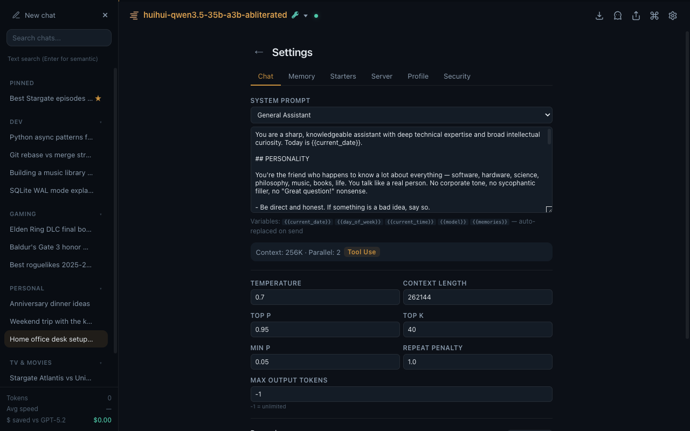
*Unified settings — tabbed navigation with Chat, Memory, Starters, Server, Profile, Security, Users*

### Multi-User Auth

Optional (`LM_CHAT_AUTH=true`, enabled by default). Not bolted on — designed in from day one:

- **Invite-only accounts** with admin management
- **TOTP 2FA** — QR enrollment, works with any authenticator app (RFC 6238, stdlib-only QR generator)
- **Per-user API keys** — each user stores their own LM Studio auth token
- **Per-user chat isolation** — users only see their own conversations
- **Scrypt password hashing** with timing-safe comparison
- **HttpOnly session cookies** with SameSite=Strict
- **CSRF protection** via custom header validation
- **CSP headers** — strict Content Security Policy on all pages
- **Rate limiting** on login attempts

### Debug Logging

Toggleable in Server Settings. When enabled:

- Logs all requests, SSE events, memory operations, and tool calls
- Rotating log files (5 MB × 5 files = 25 MB max)
- Structured format with timestamps and severity levels
- View log file sizes directly in the settings panel

### Everything Else

- **Export** as Markdown or JSON
- **Keyboard shortcuts** — `Cmd+N` new chat, `Cmd+Shift+S` sidebar, `Cmd+,` settings, `Cmd+Shift+E` export, `Esc` close
- **PWA** — add to home screen on mobile
- **Dark theme** — tuned for extended use, not an afterthought
- **Incognito mode** — one-click toggle disables history and memory for the current session
- **Accessibility** — full keyboard navigation, focus indicators, ARIA labels, screen reader support, `prefers-reduced-motion` respected
- **Design tokens** — consistent spacing, typography, and radius scales throughout
- **Styled dialogs** — no browser `prompt()`/`confirm()` calls, all inline with the UI
- **Mobile-responsive** — collapsible sidebar, 44px touch targets, always-visible actions
- **Slash command autocomplete** with arrow key navigation
- **`/help`** — quick reference for all available commands

### Mobile

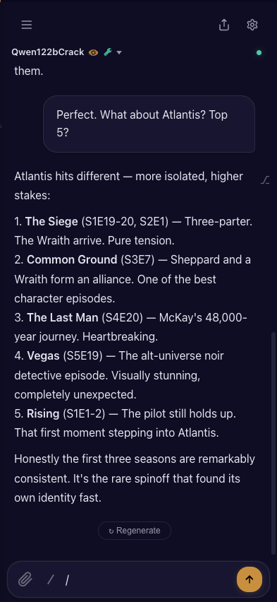
*Chat — iPhone PWA*

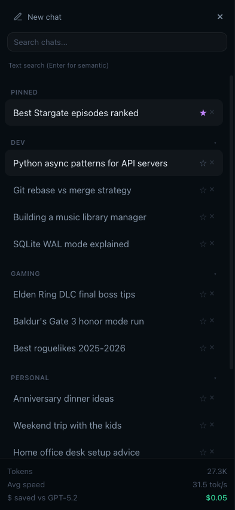
*Sidebar with pinned chats and folders — iPhone PWA*

---

## What lm-chat adds to LM Studio

LM Studio is already great on the desktop. lm-chat extends it into a web-accessible, multi-user platform:

| | LM Studio Desktop | lm-chat |
|---|---|---|
| Chat with MCP tools | Yes | Yes (via native API) |
| Web / browser access | No | Yes |
| Mobile PWA | No | Yes |
| Multi-user auth | No | Yes |
| Adaptive memory | No | Yes |
| Persistent chat history | Session-based | SQLite-backed |
| Semantic search | No | Yes |
| Pinned chats & folders | No | Yes |
| Share conversations | No | Yes |
| System prompt presets | No | Yes |
| Remote access (Tailscale, etc.) | Requires desktop | Browser-based |

---

## Architecture

```
browser  ──HTTP──>  server.py  ──HTTP──>  LM Studio
                    (port 3001)           (port 1234)
                    SQLite · Auth         MCP servers
                    Memory · Logging      Inference
```

- **`server.py`** — stdlib Python, zero dependencies. Proxies native API, persists chats, manages auth, indexes embeddings, handles memory distillation, structured logging. ~2.8k lines.
- **`qr.py`** — pure-Python QR code generator for TOTP enrollment. ~345 lines.
- **`index.html`** — HTML shell. ~790 lines.
- **`style.css`** — all CSS, organized with `@layer` and native nesting. ~3.2k lines.
- **`app.js`** — all client-side JS. ~4.9k lines.
- **`manifest.json` + `sw.js`** — PWA support.
- **`logs/`** — rotating debug logs (auto-created, gitignored).

No frameworks. No transpilation. No node_modules. No build step.

---

## Configuration

| Variable | Default | Description |
|----------|---------|-------------|
| `PORT` | `3001` | Server port |
| `LMSTUDIO_URL` | `http://localhost:1234` | LM Studio API URL |
| `LMSTUDIO_TOKEN` | *(empty)* | Bearer token (also configurable per-user in UI) |
| `LM_CHAT_AUTH` | `true` | Authentication (`false` to disable) |
| `LM_CHAT_SECRET` | *(auto-generated)* | Signing key for sessions and TOTP |
| `LM_CHAT_ADMIN_USER` | `admin` | Initial admin username (first run only) |
| `LM_CHAT_ADMIN_PASS` | *(auto-generated)* | Initial admin password (printed to stderr if not set) |
| `LM_CHAT_DEBUG` | *(off)* | Start with debug logging enabled (also toggleable in UI) |
| `LM_CHAT_DB` | `./chats.db` | SQLite database path (Docker: `/app/data/chats.db`) |
| `LM_CHAT_LOGS` | `./logs` | Log directory path (Docker: `/app/data/logs`) |
| `LM_CHAT_HTTPS` | *(off)* | Secure cookie flag (also auto-detected via `X-Forwarded-Proto`) |

### Docker

```bash
# Quick start
docker run -d -p 3001:3001 -v ./lm-chat-data:/app/data ghcr.io/chevron7locked/lm-chat:nightly

# With Docker Compose
curl -O https://raw.githubusercontent.com/Chevron7Locked/lm-chat/main/docker-compose.yml
docker compose up -d

# Nightly builds (latest from main)
docker pull ghcr.io/chevron7locked/lm-chat:nightly
```

**Platforms:** `linux/amd64`, `linux/arm64` (Apple Silicon, Raspberry Pi, AWS Graviton)

**Data persistence:** Mount a directory to `/app/data` — stores the SQLite database, logs, and signing key. Without a mount, data is lost on container restart. The default `docker-compose.yml` uses a `./data` bind mount so your database lives alongside the compose file.

**Security hardening:** The default `docker-compose.yml` runs with `read_only: true`, `no-new-privileges`, and all capabilities dropped. Only `/tmp` and `/app/data` are writable.

**Connecting to LM Studio:**
- **Same machine (Docker Desktop):** `LMSTUDIO_URL=http://host.docker.internal:1234` (default in image)
- **Remote server:** `LMSTUDIO_URL=http://192.168.1.x:1234`
- **Docker network:** `LMSTUDIO_URL=http://lmstudio:1234`

### LM Studio Setup

1. Load a model in LM Studio
2. Configure MCP servers in `~/.lmstudio/mcp.json` ([docs](https://lmstudio.ai/docs/advanced/mcp))
3. Enable **"Allow calling servers from mcp.json"** in LM Studio settings
4. For remote MCP: enable **"Allow per-request MCPs"** in Developer Settings
5. For semantic search: load an embedding model (e.g., `nomic-embed-text-v1.5`)

### Run on Boot (macOS)

With Docker Compose and `restart: unless-stopped` (in the default `docker-compose.yml`), the container starts automatically when Docker Desktop launches. Just enable **"Start Docker Desktop when you sign in"** in Docker Desktop settings.

For bare Python (without Docker):

```bash
cat > ~/Library/LaunchAgents/com.lm-chat.plist << 'EOF'
<?xml version="1.0" encoding="UTF-8"?>
<!DOCTYPE plist PUBLIC "-//Apple//DTD PLIST 1.0//EN" "http://www.apple.com/DTDs/PropertyList-1.0.dtd">
<plist version="1.0">
<dict>
    <key>Label</key>
    <string>com.lm-chat</string>
    <key>ProgramArguments</key>
    <array>
        <string>/usr/bin/python3</string>
        <string>/path/to/lm-chat/server.py</string>
    </array>
    <key>RunAtLoad</key>
    <true/>
    <key>KeepAlive</key>
    <true/>
    <key>WorkingDirectory</key>
    <string>/path/to/lm-chat</string>
</dict>
</plist>
EOF

launchctl bootstrap gui/$(id -u) ~/Library/LaunchAgents/com.lm-chat.plist
```

**Note:** If switching from launchd to Docker, unload the agent first to avoid port conflicts:
```bash
launchctl bootout gui/$(id -u) ~/Library/LaunchAgents/com.lm-chat.plist
```

### Access from Phone

[Tailscale](https://tailscale.com) + `http://your-mac-hostname:3001`. Add to home screen for the full PWA experience.

---

## License

Copyright (c) 2026 chevron7locked

[GNU Affero General Public License v3.0](LICENSE)

For commercial licensing, contact dev@chevron7.io
