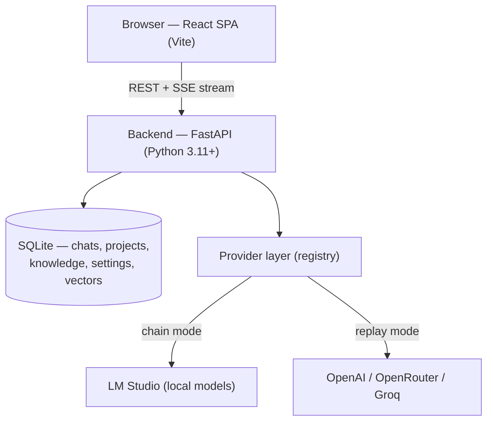

# Architecture

This page is a technical overview of how LM Chat is built, for power users, integrators, and anyone evaluating the project. It explains the moving parts, the choices behind them, and where your data lives. It is not a code walkthrough — for the HTTP surface, see [15-api-reference.md](15-api-reference.md).

If you just want to start using LM Chat, begin with [00-quickstart.md](00-quickstart.md) or [01-overview.md](01-overview.md).

## At a glance

LM Chat is a self-hosted, local-first chat application with a single admin account. You run it on your own machine (or your own server); it talks to your local models through LM Studio and, optionally, to cloud model providers. Nothing is sent to LM Chat's authors, and there is no usage tracking.

- **Frontend** — a React single-page application, built with Vite.
- **Backend** — a FastAPI service written in Python (3.11 or newer).
- **Database** — a local SQLite file by default; Postgres is also supported via `DATABASE_URL`. Your chats, projects, knowledge, and settings all live there.
- **Models** — reached through a provider layer: LM Studio for local models, plus OpenAI-compatible cloud providers (OpenAI, OpenRouter, Groq) when you configure them.

## The stack

### Frontend

The interface is a single-page application built with React and TypeScript, bundled by Vite. It uses TanStack Query to manage data fetched from the backend and a lightweight store for UI and authentication state. Chat responses stream into the page token by token over Server-Sent Events (SSE), so you see output as the model produces it rather than waiting for a complete reply.

### Backend

The backend is a FastAPI application served by an ASGI server. FastAPI gives LM Chat typed request/response models and an auto-generated API description. The chat-streaming path is fully asynchronous, which lets a single process fan out many concurrent streams without tying up a thread for each one — the time-consuming part (waiting on the model) happens cooperatively rather than blocking.

### Database

Persistence is a local SQLite database. It is zero-configuration: there is no separate database server to install or run. SQLite's full-text search is used for keyword lookup, and embeddings (vectors) are stored in the same database alongside everything else. Schema changes are applied automatically on startup, so upgrading LM Chat migrates your database for you.

### Deployment shape

LM Chat is designed for one person running their own instance: local-first, single-admin. The first account created becomes the administrator; account registration is otherwise gated. It is not built as a multi-tenant cloud service, and it does not assume it sits behind a public reverse proxy — though you can run it that way if you choose.

## The provider layer

LM Chat does not hard-code any single model backend. Instead, every backend is wrapped behind a small, provider-neutral contract — internally called a *chat provider* — and a registry holds the live set of providers by name. When you send a message, the backend looks up the right provider for the model you picked and streams the turn through it. The rest of the application (history, the interface, knowledge retrieval) is written against a single neutral event shape and does not need to know which backend produced the reply.

Adding a cloud provider at runtime simply adds an entry to the registry; the streaming path picks it up without a restart.

### Two backends, two paths

- **LM Studio** uses its native chat endpoint. This is the default path for local models.
- **OpenAI-compatible providers** — OpenAI, OpenRouter, and Groq — use the standard OpenAI-compatible request format.

Native Anthropic support is not built in. LM Chat's role is a full-featured chat interface in front of the providers above; it is not itself a model provider.

### Chain mode vs. replay mode

The two paths differ in how conversation context is carried, and this is one of the more important design choices in LM Chat:

- **Chain mode (LM Studio).** Conversation context is kept on the model server. Each new turn references the previous response by its identifier, and LM Chat forwards only the new turn rather than re-sending the entire history every time. This keeps long conversations fast and cheap, because the request size does not grow with the conversation.
- **Replay mode (cloud providers).** Cloud APIs are stateless, so LM Chat replays the relevant prior turns as part of each request. Before sending, it strips out fields that only make sense for LM Studio (the chain pointer, the integrations list, and LM-Studio-specific sampling knobs that cloud APIs would reject) so the request is accepted cleanly.

You don't choose between these modes manually — LM Chat selects the right one based on the provider behind the model you're using. The result is the same provider-neutral stream of events on screen either way. (More on picking models and providers in [04-providers-and-models.md](04-providers-and-models.md).)

## MCP and tools

Tools extend a model beyond plain text — letting it call out to a calculator, a file reader, a web search, and so on — using the Model Context Protocol (MCP). LM Chat supports tools two distinct ways, because the two model paths reach them differently. (For using tools day to day, see [05-mcp-and-tools.md](05-mcp-and-tools.md).)

- **LM Studio integrations.** LM Studio manages its own MCP servers on its side. LM Chat does not install, configure, or enumerate those servers — that stays in LM Studio's own interface. Instead, the admin maintains a list of available integration IDs in LM Chat, and the composer lets you pick which ones to enable for a given message. Your selection rides along with the chat request, and LM Studio runs the tools server-side.
- **LM Chat's own MCP host.** LM Chat also includes a built-in MCP host and an agentic tool loop of its own. This is what lets cloud models — which have no equivalent of LM Studio's integrations — use tools. LM Chat advertises the available tools to the model, watches the stream for tool requests, runs each requested tool through its host, feeds the results back, and continues the turn. The loop is bounded by a round limit so it cannot run away.

In both cases the interface shows the same thing: tool calls and their results appear inline in the stream.

## Knowledge and RAG

LM Chat can ground replies in your own material — uploaded documents, project knowledge, and past conversation memory — through retrieval-augmented generation (RAG). The entire pipeline is local. (See [07-knowledge-and-memory.md](07-knowledge-and-memory.md) for how to use it.)

- **Embeddings** are produced by an embedding model running in LM Studio, through its embeddings endpoint. LM Chat does not bundle its own embedding model.
- **Storage** is the same local SQLite database. There is no external vector database to run or maintain.
- **Retrieval is hybrid.** A keyword search (using SQLite's full-text search) and a vector similarity search run side by side, and their results are merged using Reciprocal Rank Fusion. Hybrid retrieval catches both exact-term matches and meaning-based matches, which a single method alone tends to miss.

Embeddings are tagged with the model that produced them, so vectors from different embedding models are never compared against each other — switching embedding models doesn't silently corrupt results.

## The capability cache

Local model fleets are not uniform: one model accepts a sampling parameter that another rejects, and a setting that works today may not work after you swap models. LM Chat handles this with a per-model capability cache.

When a model rejects a request parameter, LM Chat records that rejection for that specific model and stops sending the offending parameter to it on later requests — and the interface can hide controls the model doesn't support. Recorded rejections expire after a while and re-probe naturally, so a one-off failure doesn't disable a parameter permanently. The practical effect is that a fleet of differently-configured models all just work, without you tuning each one by hand.

## Security posture

LM Chat is built for a single trusted admin running their own instance. The protections below are described honestly and at a high level — there are no third-party security certifications claimed.

- **Secrets encrypted at rest.** Sensitive values, such as provider API keys and two-factor secrets, are encrypted in the database using AES-256-GCM with a key derived from a server secret. Stored values carry a versioned envelope, and plain legacy values are upgraded transparently on the next write.
- **Session cookies.** Authentication uses an HttpOnly session cookie (not readable by page scripts), scoped with a same-site policy.
- **Admin gating.** Administrative actions — managing providers, model lifecycle, and integration lists — require the admin account. The first account created becomes the admin; further registration is gated.
- **URL validation on provider targets.** Provider and LM Studio base URLs are validated to reject non-HTTP(S) schemes (so a URL can't be redirected to read a local file or use an unsafe protocol). Because LM Chat is a local admin-only app, private and loopback addresses are legitimate targets — that's where LM Studio lives — and the admin gate is the primary protection. The web-search path additionally blocks private and link-local address ranges, where the trust model differs.

## Data ownership

Everything LM Chat stores — your conversations, projects, knowledge base, documents, memory, embeddings, and settings — lives in one local SQLite database that you control. There is no telemetry, no analytics beacon, and no usage upload: the application does not phone home. Model requests go only to the providers you have configured — your local LM Studio and any cloud providers you explicitly add. Backing up LM Chat is as simple as copying the database file.

## Related pages

- [01-overview.md](01-overview.md) — what LM Chat is, in plain terms.
- [04-providers-and-models.md](04-providers-and-models.md) — connecting local and cloud models.
- [05-mcp-and-tools.md](05-mcp-and-tools.md) — using MCP integrations and tools.
- [07-knowledge-and-memory.md](07-knowledge-and-memory.md) — documents, knowledge, and memory.
- [10-settings-and-admin.md](10-settings-and-admin.md) — admin controls and configuration.
- [15-api-reference.md](15-api-reference.md) — the HTTP API surface.
